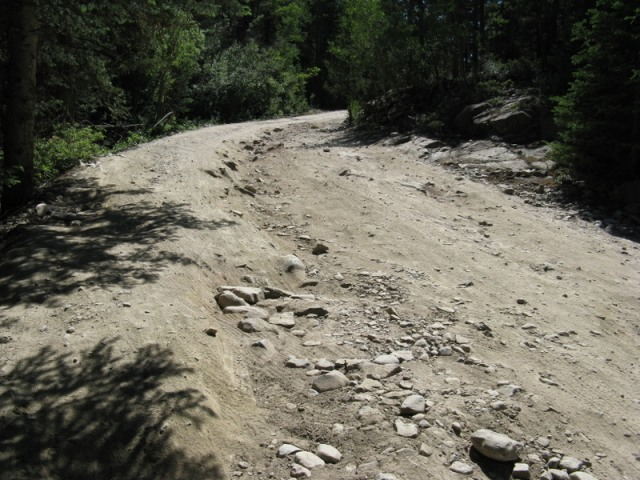
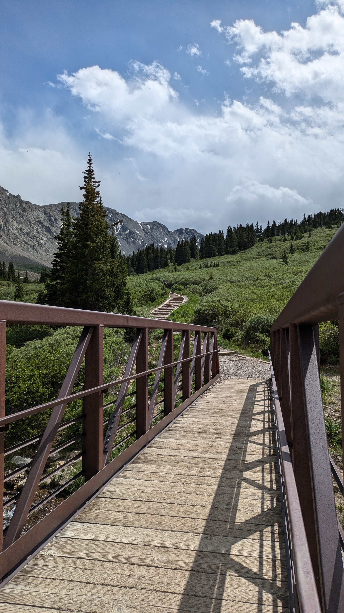
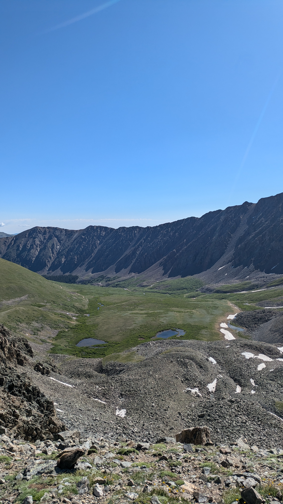

+++
title =  "Gray's Peak"
description = "Treeking Gray's"
author = "Justin Napolitano"
tags = ["mountains"]
images = ["images/feature-image.png"]
categories = ['peaks']
date = "2024-07-08"
+++

# Gray's

Gray's is a rather easy 14'er about an hour west of Denver.

* [14er Link](https://www.14ers.com/php14ers/trailheadsview.php?thparm=fr04)

## Details

* Coordinates: 39.66087, -105.78462
* Elevation: 11,280'
* Trailhead Access: High Clearence Vehicle
* Camping: Yeah
* Restrooms: Yeah  

## The Approach

I borrowed an SUV. It was a doable drive.  I kept her in first gear and took it slow. There were a few sketchy parts along the way.. but it really wasn't too bad.. at least in the right vehicle. Watch out for the ruts.

## The Trail Head

The trail head is well marked. There is a beautiful bridge over a creek.  

## Car Camping

The parking lot was full by about 4 am.  I stayed in the car the night before.  It dropped down to about 40 F. I had used only a wool blanket to sleep in.. TBH it was chilly.  I had to put on more clothing to sleep well. 

## Gear List

So I have been following a 7 ish level system for my clothing. It is pretty good.. but I need to start adapting it for my needs.  I carried too much up the mountain yesterday for the conditions.. I could have bivied at a low temp if necessary.. so I am not sure if I overpacked or not. It was just heavy

### Level 1

Just a normal base layer. Poly top and bottom.  I actually want to change this up to a grid layer for the next approach. I want to modify this by using the grid and a sun hoody as the level 1 system. I am using the Outdoor Research Astro man.. i think... with a half zip.

I think this will enable me to stay dry and warm. The sun hoody protects me from the sun and most of the wind.

### Level 2

I use a surplus grid fleece. It is basically a patagonia fleece licensed to the military.. It is good.. and durable. I like it. The one downside to this fleece is that it does not have a hood. 

 I might experiment with a senchi alpha fleece in the future. 

### Level 3

I did not have to use my level 3 fleece on this trip.  For level 3 I also have a surplus military fleece full zip to fit over the level 2. I seldom need this extra layer. As of yet I have not really had a need for it down to about 40 f. 

### Level 4

I have two level fours.

1. The patagonia something or another nylon shell
2. The Kor(i think) Air shell.  

They are pretty much the same thing tbh. I like the patagonia one slightly more because it has a hood. It is great for climbing and for quickly throwing over a level 2 or level 3 when necessary. I carry this in my cross body bag

### Level 5

My level 5 is an outdoor research smock that  I really like actually. It has a huge kangaroo pouch that can hold just about anything. For an active layer I like it a lot. 

### Level 6 

My level 6 is really just a level 5.. For the summer i think it is fine.... For the winter I should move this down a level.  I use a marmot 1.5 laminate gore tex shell. It is very breathable but supposedly not completely waterproof. I think it is fine as a soft shell... And probably good enough as a hardshell in all but the most demanding environments. 

### Level 7 

For the summer i am using a patagonia nano puff or micro puff synthetic down hoodie. It is pretty good and was nice and toasty during my summer ascent of gray's.  

For a more difficult trek I would upgrade to a feathered friends down hoodie/suit. I am not really there yet so I will hold off until necessary. 

### Bivvy

In addition to these things I carry kinda an emergency bivy system. I have an SOL breathable bivy just in case I need to shelter out. I also carry a pretty heavy duty poncho because it vents and because i can use it as an emergency tent if I have to bivvy for an evening.  

## Improvements to make on the loadout

I think this system was overkill for a summer ascent of Grays. I ended up distributing my shells and my puffy to some member of the crew that did not bring gear. That said.. if shtf I would have been able to survive a bivy situation down to about 15-20 degrees I would say.. maybe a bit lower.. TBH I kind of want to test this out...

I also need to buy some level 4/5 pants. As in a pair of rain pants or gore tex pants. 

If I end up doing something more extreme I will also need to buy a pair of level 7 pants. As of now I am fine with my hiking pants with a level 2 and the down liner.

## What Did I Actually Wear

I was okay in my level 1 and level 2 most of the time.. I added the level 4 at the peak and felt very cozy.  

* a pair of sun gloves to protect my hands from the wind. This was an absolute must

* a face gator that was just okay. There are better ones on the market that cover up more of the face and neck. I'll have to buy one of those for my next ascent. 

* Wool/poly Socks

* Fjallraven surplus pants. So my pants are basically the fjallraven hiking pants wihtout the poly bits. They are some polish surplus I found online. They performed really well. I think a little more flex would have been great.. but i spent like 30 bucks on them. I should look around for actual fjallraven surplus... i bet they have some on the market

* Altra lone peaks. They were good.  I want to ;get somethign a little less disposable... but i'm not really sure what is avaialable on the market.  I imagine a barefoot boot made of nylon with a replaceable rubber sole. Something like the old jungle boot but more barefoot style. I want them light and durable.  A replaceable sould might be overkill tbh.. IDK i just want them to not be so disposable. I hate that. 

## Water 

I brough for liters up with me. It was enough. My hike took 8 hours... it should have taken about 3. That said.. i was plenty hydrated with 4 liters of water.

## Food

I brough up about 3000 calories just to be safe. Of course it was overkill but I brought it up anyways.  

* Dates
* Peanut Butter and Honey Burritos
* Almonds
* Cliff bars 

## The Experience

### A Proposal 

I think this was a bit of a special one because my friend proposed to his now fiance on this trip.  We had to encourage her to the top, but she did well... and she said yes. 

### The Actual Hike

Gray's peak was a fairly easy approach I would say. I mean its a 14'er and should be taken seriously.. but the terrain was not horribly difficult. There were no scrambles and the switchbacks offered plenty of spots to rest on level ground. 

### The wildlife

Gray's is a very popoular peak. There are goats and marmots that interact with hikers.  I also encountered a brown capped rosy finch on the ascent... A rare bird. 

### The Weather

Sun and wind exposure.. like anything alpine.. are the primary concerns. I cover up all my skin for this reason.I bring glasses as well. It rained slightly during the afternoon.. but there was no real concern.  

## Photos

